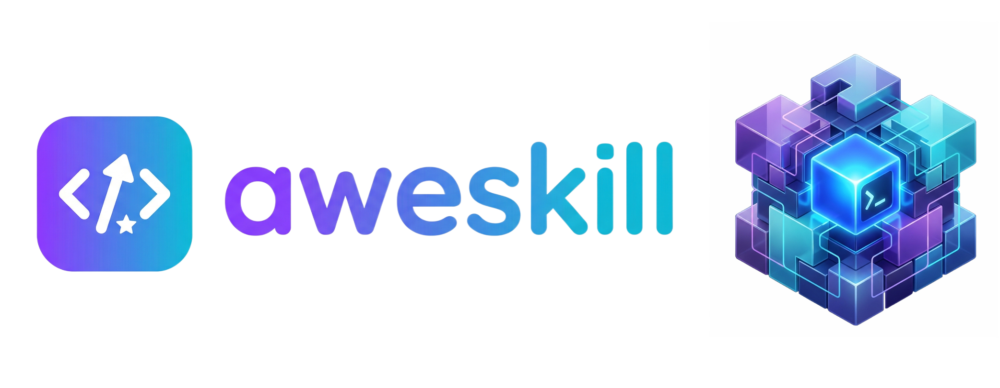

<div align="center">
  
  <h1>aweskill: One Skill Store for All Your Coding Agents</h1>
  <p><strong>Local skill orchestration CLI for AI coding agents.</strong></p>
  <p>
    <a href="https://github.com/mugpeng/aweskill/releases"></a>
    <a href="https://github.com/mugpeng/aweskill"></a>
    <a href="https://github.com/mugpeng/aweskill/blob/main/LICENSE"></a>
    <a href="./README.zh-CN.md"></a>
  </p>
  <p>
    
    
    
    
  </p>
</div>

`aweskill` is a local CLI for managing, bundling, and projecting skills across AI coding agents.

Instead of copying the same skill folders into every tool by hand, `aweskill` keeps a single source of truth in `~/.aweskill/skills/` and projects those skills into agent-specific directories with `symlink` or `copy`, depending on the target agent.

## Why aweskill

- **One central store** for all your local skills
- **Bundle-based organization** for reusable skill sets
- **Multi-agent projection** across Codex, Claude Code, Cursor, Gemini CLI, and more
- **Managed enable/disable model** without a separate global activation file
- **Backup, restore, dedupe, and recovery** built into the CLI

## Quick Start

```bash
# 1. Initialize the aweskill home
aweskill store init

# 2. Scan existing agent skill directories
aweskill skill scan

# 3. Import a skills root or a single skill
aweskill skill import ~/.agents/skills
# aweskill skill import /path/to/my-skill --mode cp

# 4. Create a bundle
aweskill bundle create frontend
aweskill bundle add frontend my-skill

# 5. Enable the bundle for one agent
aweskill agent add bundle frontend --global --agent claude-code

# 6. Inspect current projected skills
aweskill agent list
```

## Core Model

`aweskill` follows a simple projection model:

1. Skills live in one central repository: `~/.aweskill/skills/<skill-name>/`
2. Bundles are plain YAML files in `~/.aweskill/bundles/<bundle>.yaml`
3. `agent add` projects selected skills into each agent's skills directory

That projection is the activation model.

- If a managed symlink or copy exists, the skill is enabled
- If it does not exist, the skill is disabled
- There is no separate global activation registry to reconcile

## What It Supports

Supported agents currently include:

`amp`, `claude-code`, `cline`, `codex`, `cursor`, `gemini-cli`, `goose`, `opencode`, `roo`, `windsurf`

Key directories:

- Central store: `~/.aweskill/skills/`
- Duplicate holding area: `~/.aweskill/dup_skills/`
- Backup archive: `~/.aweskill/backup/`
- Bundles: `~/.aweskill/bundles/*.yaml`

## Common Workflows

### Import skills into the central store

```bash
aweskill skill import ~/.agents/skills
aweskill skill import ~/Downloads/pr-review --mode cp
aweskill skill import --scan
```

### Build reusable bundles

```bash
aweskill bundle create backend
aweskill bundle add backend api-design,db-schema
aweskill bundle show backend
```

### Project skills into agents

```bash
aweskill agent add skill biopython
aweskill agent add skill biopython,scanpy --global --agent codex
aweskill agent add bundle backend --global --agent all
```

### Keep the store clean

```bash
aweskill store backup
aweskill agent sync
aweskill agent recover --global --agent codex
aweskill doctor dedupe --fix
```

## Install

### Install from this repository

```bash
npm install
npm run build
npm install -g .
```

### Local development link

```bash
npm install
npm link
aweskill --help
```

### Install from packed tarball

```bash
npm install
npm pack
npm install -g ./aweskill-0.1.5.tgz
```

## Command Surface

| Command | Description |
| --- | --- |
| `aweskill store init [--scan] [--verbose]` | Create the `~/.aweskill` layout |
| `aweskill store backup` | Archive the central skill store |
| `aweskill store restore <archive> [--override]` | Restore a previous backup |
| `aweskill skill scan [--verbose]` | Scan supported agent skill directories |
| `aweskill skill import <path> [--mode cp\|mv] [--override]` | Import a skill or an entire skills root |
| `aweskill skill import --scan [--mode cp\|mv] [--override]` | Import the current scan results |
| `aweskill skill list [--verbose]` | List skills in the central store |
| `aweskill skill remove <skill> [--force]` | Remove one skill from the central store |
| `aweskill bundle list [--verbose]` | List central bundles |
| `aweskill bundle create <name>` | Create a bundle |
| `aweskill bundle add <bundle> <skill>` | Add one or more skills to a bundle |
| `aweskill bundle remove <bundle> <skill>` | Remove one or more skills from a bundle |
| `aweskill bundle show <name>` | Inspect bundle contents |
| `aweskill bundle template list [--verbose]` | List built-in bundle templates |
| `aweskill bundle template import <name>` | Copy a built-in template bundle into the store |
| `aweskill agent supported` | List supported agent ids and display names |
| `aweskill agent add bundle\|skill ...` | Project managed skills into agent directories |
| `aweskill agent remove bundle\|skill ... [--force]` | Remove managed projections |
| `aweskill agent list [...]` | Inspect linked, duplicate, and new entries |
| `aweskill agent sync` | Remove stale managed projections |
| `aweskill agent recover` | Convert managed symlinks into full directories |
| `aweskill doctor dedupe [--fix] [--delete]` | Find and optionally clean duplicate skills |

## Design Choices

### No global activation file

`aweskill` treats the projected filesystem state as the truth. This keeps the model simple and avoids a second layer of activation metadata drifting out of sync.

### Bundles are expansion sets

`agent add bundle <name>` expands the bundle into skill names and projects those skills. There is no separate long-lived "bundle activation" object after projection.

### Managed-only removal

`aweskill` removes only entries it can identify as its own managed symlinks or managed copies. It does not blindly delete arbitrary skill directories.

## Bundle File Format

Bundles are plain YAML under `~/.aweskill/bundles/<name>.yaml`:

```yaml
name: frontend
skills:
  - pr-review
  - frontend-design
```

## Projection Model

1. **Central source of truth for skill content**: `~/.aweskill/skills/<skill-name>/`.
2. **`agent add`** creates, for each selected agent and scope:
   - a **symlink** to that directory (most agents), or
   - a **recursive copy** with a small marker file (for example Cursor).
3. **`agent remove`** removes only entries that are **managed by aweskill**.
4. **`agent sync`** removes managed projections whose central skill path is missing.

There is **no** reconcile pass driven by a global YAML activation list.

Import behavior:

- Default `skill import --scan` and batch `skill import` merge only missing files when the central skill already exists; `--override` overwrites.
- When the source is a symlink, aweskill copies from the resolved real path and may print a warning.
- Broken symlinks during batch import are reported; other items continue.
- `restore` automatically creates a fresh backup of the current `skills/` tree before applying the archive.

Display behavior:

- `skill list` shows totals and a short preview unless `--verbose`.
- `skill scan` shows per-agent totals by default; `--verbose` lists concrete scanned skills.
- `agent list` categorizes `linked`, `duplicate`, and `new`; `--update` imports and relinks where needed.
- `doctor dedupe` treats `name`, `name-2`, and `name-1.2.3` as one duplicate family and only modifies files when `--fix` is passed.

Projection examples:

```bash
# Global projection for one agent
aweskill agent add skill biopython --global --agent codex

# Project-scoped projection for one agent
aweskill agent add skill pr-review --project /path/to/repo --agent cursor

# Bundle expansion writes individual managed projections
aweskill agent add bundle backend --global --agent codex
aweskill agent remove bundle backend --global --agent codex

# Convert symlink projections into copied directories
aweskill agent recover --global --agent codex
```

## Templates

Reference bundle templates live in [template/bundles/K-Dense-AI-scientific-skills.yaml](/Users/peng/Desktop/Project/aweskills/template/bundles/K-Dense-AI-scientific-skills.yaml). Runtime bundles still live under `~/.aweskill/bundles/`.

## Supported Agents

| Agent | Global Path | Project Path | Mode |
| --- | --- | --- | --- |
| `amp` | `~/.amp/skills/` | `<project>/.amp/skills/` | `symlink` |
| `claude-code` | `~/.claude/skills/` | `<project>/.claude/skills/` | `symlink` |
| `cline` | `~/.cline/skills/` | `<project>/.cline/skills/` | `symlink` |
| `codex` | `~/.codex/skills/` | `<project>/.codex/skills/` | `symlink` |
| `cursor` | `~/.cursor/skills/` | `<project>/.cursor/skills/` | `copy` |
| `gemini-cli` | `~/.gemini/skills/` | `<project>/.gemini/skills/` | `symlink` |
| `goose` | `~/.goose/skills/` | `<project>/.goose/skills/` | `symlink` |
| `opencode` | `~/.opencode/skills/` | `<project>/.opencode/skills/` | `symlink` |
| `roo` | `~/.roo/skills/` | `<project>/.roo/skills/` | `symlink` |
| `windsurf` | `~/.windsurf/skills/` | `<project>/.windsurf/skills/` | `symlink` |

## Related Tools

If you are exploring the broader skills ecosystem, these projects are worth using and studying:

- [Skills Manager](https://github.com/jiweiyeah/Skills-Manager): a desktop application for managing skills across multiple AI coding assistants, with synchronization and GUI-driven organization.
- [skillfish](https://github.com/knoxgraeme/skillfish): a CLI-first skill manager focused on installing, updating, and syncing skills across agents.
- [vercel-labs/skills](https://github.com/vercel-labs/skills): a widely adopted open agent-skills CLI and ecosystem entry point built around reusable `SKILL.md` packages.
- [cc-switch](https://github.com/farion1231/cc-switch): a desktop all-in-one manager for Claude Code, Codex, Gemini CLI, OpenCode, and related local AI tooling.

`aweskill` references and learns from all four of these projects. They helped clarify different parts of the design space:

- desktop-first multi-tool management
- CLI-first skill installation and synchronization
- open skill ecosystem conventions
- cross-agent local developer workflow tooling

## Development

```bash
npm install
npm test
npm run build
node dist/index.js --help
```

## License

This project is licensed under [MPL-2.0](./LICENSE).
