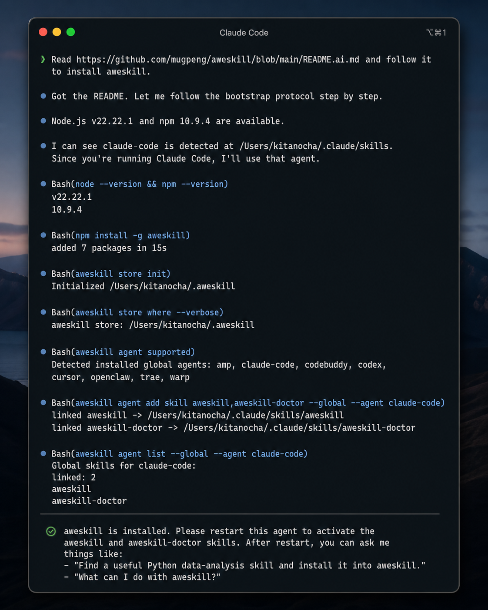

# Let Your AI Agent Manage aweskill for You

Most developer tools still assume the human is the operator.

You read the documentation. You install the CLI. You decide where files should go. You copy commands from a README, paste them into a terminal, check the output, fix the path, and then explain the final state back to your AI coding agent.

That made sense when tools were only built for humans.

But AI coding agents now run commands, inspect files, follow project conventions, and repair broken local state. If a tool is meant to help agents, the better question is not:

> How does a human use this CLI?

It is:

> Can the agent operate the CLI by itself?

That is one of the quiet but important ideas behind `aweskill`: it is a CLI-first Skill package manager that AI agents can operate themselves.

Website: [aweskill.webioinfo.top](https://aweskill.webioinfo.top/)

## The Old Workflow: You Manage the Agent's Tools

When a new AI Agent needs a Skill, the usual workflow looks like this:

1. You find the Skill.
2. You download or copy it.
3. You locate the agent's Skill directory.
4. You place `SKILL.md` in the right folder.
5. You restart the agent.
6. You hope the next agent uses the same layout.

This is manageable once.

It becomes messy when you use Codex, Claude Code, Cursor, Gemini CLI, Windsurf, Qwen Code, OpenCode, or any other coding agent side by side. Each one has its own directory layout and conventions. The human becomes the package manager.

That is backward.

If the agent is already capable of editing your repo, running tests, and diagnosing failures, it should also be able to manage its own Skills.

## The aweskill Workflow: Give the Agent a Protocol

`aweskill` provides a bootstrap document written for AI coding agents:

```text
Read https://github.com/mugpeng/aweskill/blob/main/README.ai.md and follow it to install aweskill for this agent.
```

That instruction is enough for a capable coding agent to do the initial setup.

The protocol tells the agent to:

- check that Node.js and npm are available
- install `aweskill` globally
- initialize the central Skill store at `~/.aweskill/skills/`
- detect the current agent runtime
- project the built-in `aweskill` and `aweskill-doctor` Skills into that agent
- verify the projection
- ask you to restart so the new Skills become active



After that restart, you no longer have to remember every command. You can ask the agent in plain language.

## What the Agent Can Do After Bootstrap

`aweskill` ships two built-in meta-Skills:

- `aweskill`: routine Skill management, including search, install, update, bundles, and agent projection
- `aweskill-doctor`: repair-first workflows, including sync checks, cleanup, deduplication, malformed `SKILL.md` repair, and recovery

Once these are projected into the current agent, the agent can translate natural-language requests into `aweskill` commands.

Instead of typing:

```bash
aweskill find review
aweskill install owner/repo
aweskill agent add skill pr-review --global --agent codex
```

You can say:

```text
Find a good code-review Skill, install it into aweskill, and enable it for this agent.
```

The agent can search, inspect results, choose an installable source, run the install, project the Skill, and verify the result.

That is the difference between a CLI that agents can call and a CLI that humans must babysit.

## Use Case 1: Bootstrap a Fresh Agent

You open a new machine, a fresh terminal, or a newly installed coding agent. Instead of manually setting up its Skill directory, you give it one instruction:

```text
Read README.ai.md from the aweskill repo and install aweskill for this agent.
```

The agent follows the bootstrap protocol:

```bash
npm install -g aweskill
aweskill store init
aweskill store where --verbose
aweskill agent supported
aweskill agent add skill aweskill,aweskill-doctor --global --agent <agent-id>
aweskill agent list --global --agent <agent-id>
```

The important detail is that the protocol is conservative. If the agent cannot determine the correct `agent-id`, it should ask you instead of guessing. It should not project Skills to every installed agent by default.

That makes the bootstrap flow agent-friendly without being reckless.

## Use Case 2: Ask the Agent to Find and Install a Skill

You are working on a Python data project and want a useful data-analysis Skill.

You do not need to browse registries yourself. You can ask:

```text
Find a useful Python data-analysis Skill and install the best match into aweskill.
```

The agent can run:

```bash
aweskill find python data analysis
```

Then it can inspect the results, avoid unsupported discover-only entries, install the best available source, and report what it did:

```bash
aweskill install <source>
```

If the Skill should be active in the current agent, the agent can project it:

```bash
aweskill agent add skill <skill-name> --global --agent <agent-id>
```

The human stays in the loop for judgment. The agent handles the mechanical work.

## Use Case 3: Build a Project Bundle by Conversation

Bundles are where agent-operated Skill management starts to feel natural.

Instead of remembering which Skills belong in a frontend project, you can ask:

```text
Create a frontend bundle with the Skills we need for UI design, accessibility review, test-driven development, and release checks. Enable it for this agent.
```

The agent can turn that into a sequence:

```bash
aweskill bundle create frontend
aweskill bundle add frontend frontend-design,accessibility-review,test-driven-development,release-checklist
aweskill agent add bundle frontend --global --agent <agent-id>
aweskill agent list --global --agent <agent-id>
```

The real value is not saving a few keystrokes. The value is that the agent can reason from the project context, select a relevant group of Skills, make the bundle repeatable, and verify that the current agent can use it.

Later, when you move the same project to another coding tool, the bundle is still there.

## Use Case 4: Let the Agent Check for Updates

Skills age like any other dependency. Instructions change. Upstream authors fix bugs. Registries improve metadata. Local copies drift.

Instead of manually checking each Skill, you can ask:

```text
Check whether any installed Skills have source updates, but do not change files yet.
```

The agent can run:

```bash
aweskill update --check
```

Then it can summarize the result and ask before applying changes.

If you approve, it can run targeted updates:

```bash
aweskill update <skill-name>
```

This is especially useful when you use the same Skill across Codex, Claude Code, Cursor, and Gemini CLI. The projected agents point back to the central store, so one updated source becomes available everywhere it is projected.

## Use Case 5: Ask the Agent to Repair Skill State

Local Skill directories are not static. Agents update. Paths change. Symlinks break. Someone manually copies a folder into a managed directory. Another Skill has malformed frontmatter.

This is where `aweskill-doctor` matters.

You can ask:

```text
Check whether this agent's Skills are broken, duplicated, or suspicious. Show me the report first.
```

The agent can run read-only checks:

```bash
aweskill agent list --global --agent <agent-id>
aweskill doctor sync --global --agent <agent-id>
aweskill doctor clean
aweskill doctor dedup
aweskill doctor fix-skills
```

The repair commands are dry-run by default. The agent can inspect the report, explain the risk, and only apply changes when you explicitly approve:

```bash
aweskill doctor sync --global --agent <agent-id> --apply
aweskill doctor dedup --apply --backup
aweskill doctor fix-skills --apply --backup
```

This is the right division of labor: the agent diagnoses and prepares the repair; the human approves destructive or state-changing actions.

## Use Case 6: Migrate a Working Setup to Another Agent

Suppose you have a good setup in Codex and now want a similar setup in Claude Code.

You can ask:

```text
Look at the Skills and bundles available in aweskill, then project the daily coding setup into Claude Code.
```

The agent can inspect the central store and bundles, then run:

```bash
aweskill agent supported
aweskill agent add bundle daily-coding --global --agent claude-code
aweskill agent list --global --agent claude-code
```

No manual copying. No guessing where Claude Code stores Skills. No stale folder fork.

One central store. One bundle. Another agent enabled.

## Use Case 7: Back Up Before a Risky Change

Before a large cleanup or migration, you can ask:

```text
Back up my aweskill store before making any Skill changes.
```

The agent can run:

```bash
aweskill store backup
```

Then it can proceed with the requested work. If something goes wrong, the central store can be restored instead of rebuilt from memory.

This is a small detail, but it changes the psychology of maintenance. You can let the agent help because the state is recoverable.

## Why This Matters

Agent-operated tooling changes the shape of developer workflow.

The best tools for AI coding agents should be:

- documented for both humans and agents
- scriptable through a stable CLI
- conservative about destructive actions
- inspectable before applying changes
- easy to verify after each operation
- recoverable when local state drifts

`aweskill` is built around that model.

It is still useful as a normal human-operated CLI. You can run every command yourself. But the more interesting workflow is giving your agent enough structure to operate the tool safely on your behalf.

That is why `README.ai.md` exists.

That is why `aweskill` and `aweskill-doctor` are built-in Skills.

And that is why Skill management should not stay trapped in manual folder work.

## Try It

If you want the fastest path, ask your current coding agent:

```text
Read https://github.com/mugpeng/aweskill/blob/main/README.ai.md and follow it to install aweskill for this agent.
```

After restart, try:

```text
Find a useful testing Skill and install it into aweskill.
```

Then:

```text
Check whether this agent's Skill projection is healthy.
```

If those three requests work, your agent is no longer just using Skills. It can help manage them.

---

**Website**: [aweskill.webioinfo.top](https://aweskill.webioinfo.top/)

**Install**: `npm install -g aweskill`

**Agent bootstrap**: [README.ai.md](https://github.com/mugpeng/aweskill/blob/main/README.ai.md)

**GitHub**: [github.com/mugpeng/aweskill](https://github.com/mugpeng/aweskill)
